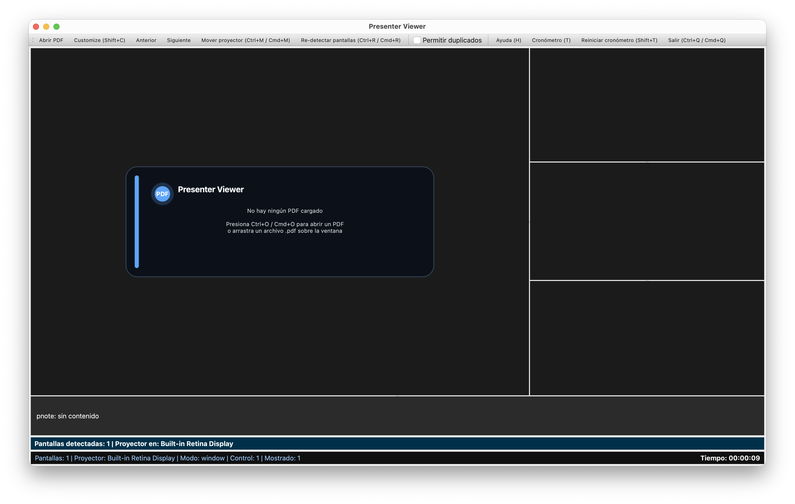
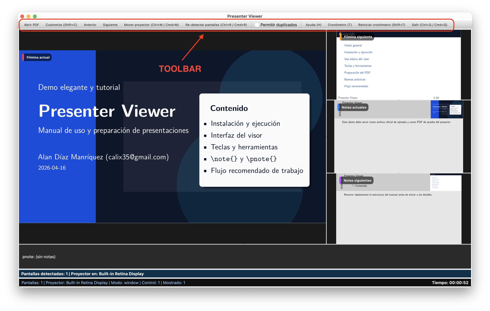
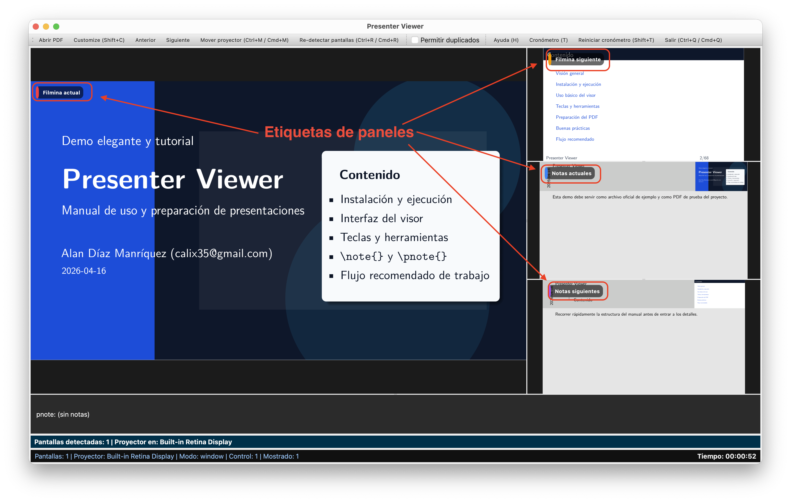
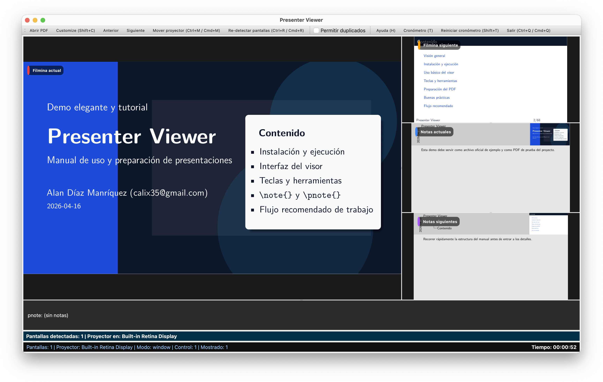
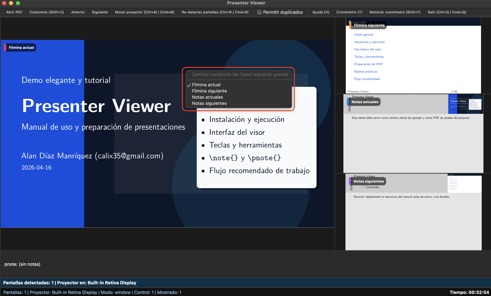
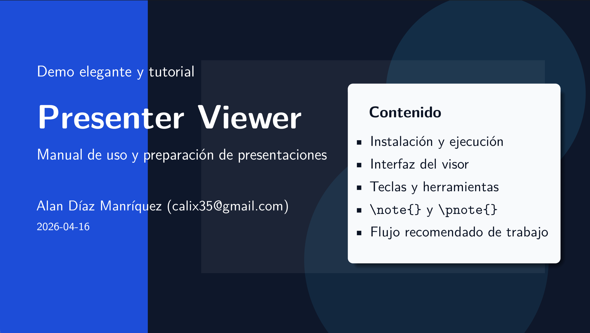
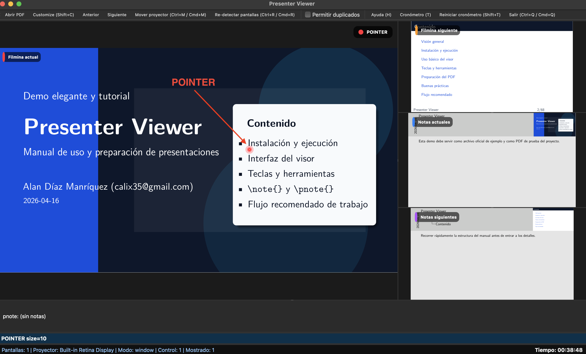
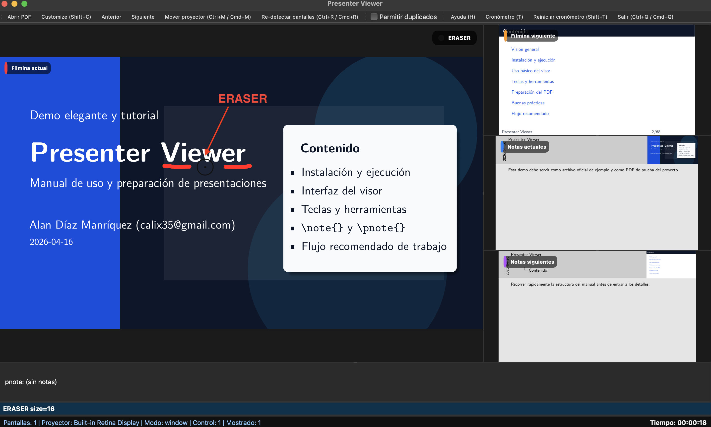
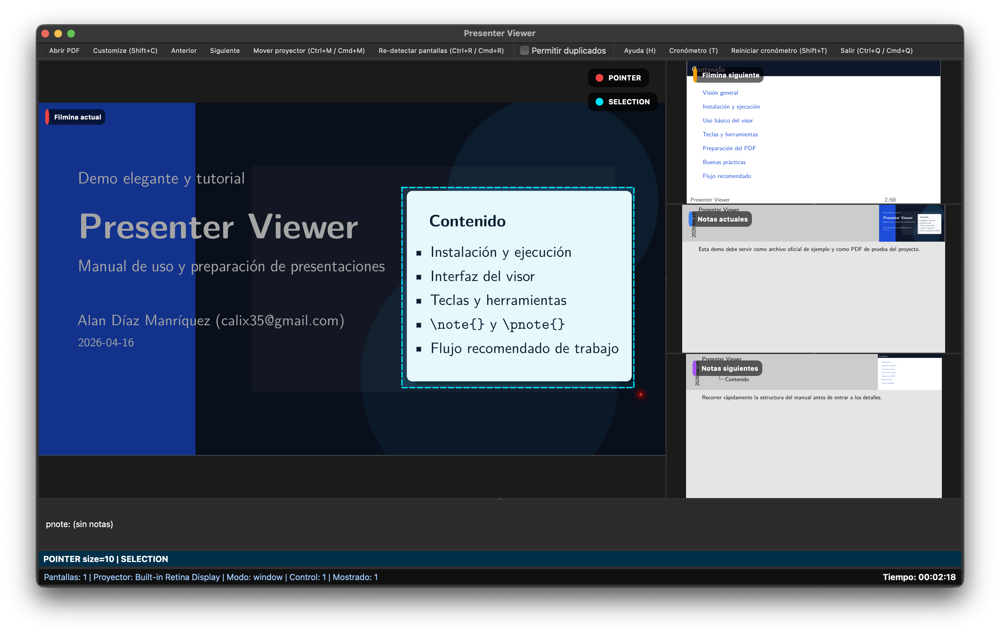

# Presenter Viewer

<p align="center">
  
</p>

<p align="center">
  <strong>Visor de presentaciones para el expositor</strong><br>
  Controla tu PDF, tus notas, tus paneles y tu proyector desde una sola interfaz.
</p>

<p align="center">
  
  
  
  
  
  
  
</p>

---

## Tabla de contenido

- [¿Qué es Presenter Viewer?](#qué-es-presenter-viewer)
- [¿Para qué sirve?](#para-qué-sirve)
- [Flujo de trabajo general](#flujo-de-trabajo-general)
- [Instalación y ejecución](#instalación-y-ejecución)
  - [Requisitos](#requisitos)
  - [Clonar el repositorio](#clonar-el-repositorio)
  - [Crear y activar un entorno virtual](#crear-y-activar-un-entorno-virtual)
  - [Instalar dependencias desde `requirements.txt`](#instalar-dependencias-desde-requirementstxt)
  - [Instalación del proyecto en modo editable](#instalación-del-proyecto-en-modo-editable)
  - [Ejecución de la aplicación](#ejecución-de-la-aplicación)
  - [Comportamiento al iniciar](#comportamiento-al-iniciar)
  - [Abrir un PDF manualmente](#abrir-un-pdf-manualmente)
  - [Soporte de drag & drop](#soporte-de-drag--drop)
- [Uso básico del visor](#uso-básico-del-visor)
  - [Interfaz principal](#interfaz-principal)
  - [Barra de herramientas](#barra-de-herramientas)
  - [Distribución de paneles](#distribución-de-paneles)
  - [Etiquetas de panel](#etiquetas-de-panel)
  - [Abrir un PDF](#abrir-un-pdf)
  - [Navegación básica](#navegación-básica)
  - [Configuración de paneles](#configuración-de-paneles)
  - [Persistencia del layout](#persistencia-del-layout)
  - [Selección de panel](#selección-de-panel)
  - [Control del proyector](#control-del-proyector)
- [Teclas y herramientas](#teclas-y-herramientas)
  - [Navegación con teclado](#navegación-con-teclado)
  - [Tipos de panel](#tipos-de-panel)
  - [Uso de paneles duplicados](#uso-de-paneles-duplicados)
  - [Atajos para paneles](#atajos-para-paneles)
  - [Personalización del layout](#personalización-del-layout)
  - [Modos principales](#modos-principales)
  - [Uso del puntero](#uso-del-puntero)
  - [Dibujo sobre la presentación](#dibujo-sobre-la-presentación)
  - [Uso del borrador](#uso-del-borrador)
  - [Spotlight](#spotlight)
  - [Selección y zoom](#selección-y-zoom)
  - [Cronómetro](#cronómetro)
  - [Control del proyector desde teclado](#control-del-proyector-desde-teclado)
  - [Interfaz y control general](#interfaz-y-control-general)
  - [Resumen de atajos clave](#resumen-de-atajos-clave)
- [Preparación del PDF](#preparación-del-pdf)
  - [Preparación desde LaTeX](#preparación-desde-latex)
  - [Configuración mínima recomendada](#configuración-mínima-recomendada)
  - [Uso de `\note{}`](#uso-de-note)
  - [Agregar `\pnote`](#agregar-pnote)
  - [Notes vs Pnotes](#notes-vs-pnotes)
  - [PDFs sin panel de notas](#pdfs-sin-panel-de-notas)
  - [Buenas prácticas](#buenas-prácticas)
- [Buenas prácticas de exposición](#buenas-prácticas-de-exposición)
- [Flujo recomendado](#flujo-recomendado)
- [Referencia de inspiración](#referencia-de-inspiración)
- [Autor](#autor)

---

## ¿Qué es Presenter Viewer?

**Presenter Viewer** es un visor de presentaciones para el expositor, diseñado para trabajar cómodamente con PDFs académicos o profesionales y mostrar en una misma interfaz la información que el ponente necesita durante la exposición.

### Características principales

- visualiza la **filmina actual**
- permite consultar la **siguiente filmina**
- soporta **notes** exportadas desde Beamer
- integra **pnotes** como apoyo breve y táctico
- ofrece herramientas interactivas para presentar en vivo
- separa la **vista del presentador** de la **salida del público**

> [!TIP]
> Presenter Viewer no busca ser solo un lector de PDF. Su objetivo es ofrecer **control total de la presentación** sin exponer al público la lógica interna del presentador.

---

## ¿Para qué sirve?

### Clases
Permite exponer con notes, cronómetro, navegación visual y apoyo privado. Es útil para cursos, laboratorios, demostraciones y sesiones híbridas.

### Conferencias
Facilita mantener ritmo, foco visual y separación limpia entre presentador y proyector. Es especialmente valioso cuando hay dos pantallas o proyector externo.

### Defensas
Ayuda a resaltar detalles, controlar tiempos y conservar recordatorios discretos. Resulta muy útil en tesis, coloquios, seminarios y presentaciones técnicas.

### Ensayos
Sirve como entorno realista de práctica antes de la exposición formal. Permite validar flujo, herramientas, layout y tiempo de intervención.

---

## Flujo de trabajo general

```text
LaTeX → PDF → Presenter Viewer → Configurar paneles → Presentar
```

En términos prácticos:

1. Crear la presentación en Beamer.
2. Exportar el PDF final.
3. Abrirlo en Presenter Viewer.
4. Ajustar paneles y herramientas.
5. Conectar el proyector o segunda pantalla.
6. Exponer con control del flujo.

> [!IMPORTANT]
> La meta es separar claramente la **vista del presentador** de la **salida del público**.

---

# Instalación y ejecución

## Requisitos

Antes de ejecutar Presenter Viewer, conviene contar con:

- Python 3.x
- dependencias del proyecto instaladas
- un entorno gráfico compatible con PyQt
- un archivo PDF listo para abrir

> [!TIP]
> Trabaja dentro de un entorno virtual para mantener las dependencias aisladas y evitar conflictos con otras instalaciones de Python.

## Clonar el repositorio

```bash
git clone https://github.com/calix35/PresenterViewer.git
cd presenter_viewer
```

> [!NOTE]
> Mantén el proyecto en una carpeta dedicada para ubicar fácilmente `samples`, `images` y los archivos PDF de prueba.

## Crear y activar un entorno virtual

### Crear el entorno

```bash
python -m venv .venv
```

### Activar en Windows

```bash
.venv\Scripts\activate
```

### Activar en Linux/macOS

```bash
source .venv/bin/activate
```

## Instalar dependencias desde `requirements.txt`

```bash
python -m pip install -r requirements.txt
```

Entre las dependencias debe encontrarse **PyQt** o la variante de Qt utilizada por el proyecto, ya que la interfaz gráfica depende de ella.

### ¿Por qué usar `requirements.txt`?

- reproduce el entorno exacto del proyecto
- facilita instalación en otra computadora
- reduce inconsistencias entre sistemas

## Instalación del proyecto en modo editable

La forma recomendada para desarrollo es:

```bash
python -m pip install -e .
```

Ventajas:

- registra el comando `presenter-viewer`
- permite ejecutar la aplicación como programa
- deja modificar el código sin reinstalar todo cada vez

> [!TIP]
> Este modo es ideal mientras todavía se están haciendo pruebas, ajustes o correcciones.

## Ejecución de la aplicación

### Comando principal

```bash
presenter-viewer
```

### Abrir un PDF directamente

```bash
presenter-viewer archivo.pdf
```

### Alternativa

```bash
python -m presenter_viewer.main
```

## Comportamiento al iniciar

Los escenarios más habituales son:

- si se pasa un PDF al iniciar, la aplicación lo abre automáticamente
- si no se pasa PDF, puede intentar cargar un archivo de ejemplo
- si no existe un ejemplo, la ventana queda lista para abrir un archivo manualmente

### Aplicación iniciada sin PDF



En este caso normalmente se observa:

- ventana principal activa
- paneles vacíos o en espera
- controles disponibles
- opción clara para abrir un archivo

### Aplicación iniciada con PDF cargado


Conviene verificar que aparezcan correctamente:

- la filmina actual
- los paneles auxiliares
- las notes, si el PDF las incluye
- la interfaz lista para presentar

> [!IMPORTANT]
> Revisa de inmediato si el archivo fue detectado como PDF normal o como PDF con notes.

## Abrir un PDF manualmente

Hay varias formas de abrir un PDF:

- desde el botón o menú de abrir archivo
- con atajo de teclado
- arrastrando el archivo PDF a la ventana

### Atajo sugerido

- **Ctrl+O** en Windows y Linux
- **Cmd+O** en macOS

## Soporte de drag & drop

Presenter Viewer puede admitir arrastrar y soltar archivos PDF directamente sobre la ventana.

Ventajas:

- agiliza la apertura
- evita navegar por cuadros de diálogo
- hace más natural el uso en escritorio

> [!WARNING]
> El archivo debe ser un PDF válido y conviene verificar de inmediato si se detectó como PDF normal o como PDF con notes.

---

# Uso básico del visor

## Interfaz principal


La ventana principal del presentador concentra varios elementos importantes:

- panel principal con la filmina actual
- paneles auxiliares
- barra inferior de estado
- herramientas activas
- cronómetro y controles

> [!TIP]
> El presentador ve múltiples elementos, pero el público solo ve la filmina.

## Barra de herramientas



La barra superior reúne varias acciones frecuentes, por ejemplo:

- abrir PDF
- navegación básica
- modos de interacción
- acceso rápido a funciones clave

## Distribución de paneles

Una distribución recomendada es:

- panel grande: filmina actual
- panel superior derecho: siguiente
- panel medio derecho: notes actuales
- panel inferior derecho: notes siguientes

## Etiquetas de panel



Las etiquetas ayudan a:

- identificar cada panel
- validar configuración
- evitar errores antes de exponer

## Abrir un PDF



Al abrir un documento, normalmente ocurre lo siguiente:

- se carga el documento
- se asignan paneles automáticamente
- se detectan notes si existen
- se habilita la navegación

## Navegación básica

La navegación debe sentirse **rápida, natural y sin distracciones**.  
En la práctica esto implica:

- avanzar y retroceder entre páginas
- revisar la siguiente filmina
- saltar al inicio o final
- mantener el ritmo de exposición

## Configuración de paneles



Los paneles pueden configurarse para mostrar:

- filmina actual
- siguiente
- notes actuales
- notes siguientes

## Persistencia del layout

Presenter Viewer guarda automáticamente la distribución de paneles en un archivo:

```text
layout.json
```

Ese archivo:

- almacena la configuración de paneles
- guarda posiciones y contenidos
- permite restaurar el layout al reiniciar

### Ubicación típica

```text
./layout.json
```

> [!NOTE]
> Si algo se rompe visualmente, eliminar este archivo puede restaurar el comportamiento por defecto.

## Selección de panel

El sistema permite trabajar con un **panel seleccionado** para aplicar acciones específicas, por ejemplo:

- cambiar contenido de un panel
- ajustar layout
- trabajar con teclado de forma precisa

## Control del proyector




El concepto clave es que el presentador y la audiencia ven cosas distintas:

- el presentador conserva paneles, notes y herramientas
- el público solo ve la salida limpia del proyector

---

# Teclas y herramientas

## Navegación con teclado

### Avanzar
`Right` · `Space` · `Down` · `PageDown`

### Retroceder
`Left` · `Backspace` · `Up` · `PageUp`

### Inicio y final
`Home` · `End`

## Tipos de panel


Los tipos de panel disponibles son:

- filmina actual
- siguiente filmina
- notes actuales
- notes siguientes

## Uso de paneles duplicados

El visor permite asignar el mismo tipo de contenido a múltiples paneles.

Ejemplos:

- ver varias copias de la filmina actual
- mostrar notes en más de un panel
- crear layouts personalizados
- adaptar el entorno al estilo del expositor

## Atajos para paneles

### Seleccionar panel
`Ctrl/Cmd + 1` · `Ctrl/Cmd + 2` · `Ctrl/Cmd + 3` · `Ctrl/Cmd + 4`

### Asignar contenido
`Alt/Option + 1` · `Alt/Option + 2` · `Alt/Option + 3` · `Alt/Option + 4`

### Flujo típico
**Seleccionar panel → Asignar contenido**

## Personalización del layout

- `Shift + C` → modo customize
- `L` → mostrar etiquetas

Esto permite:

- reorganizar paneles
- visualizar etiquetas
- ajustar el entorno de trabajo

## Modos principales

- `1` → normal
- `2` → pointer
- `3` → pen
- `4` → eraser
- `5` → spotlight

### Qué hace cada modo

- **Normal:** navegación general
- **Pointer:** señalar elementos
- **Pen:** dibujar
- **Eraser:** borrar trazos
- **Spotlight:** enfocar una zona

## Uso del puntero



El puntero sirve para:

- señalar elementos
- guiar la atención
- enfatizar detalles

> [!WARNING]
> Evita movimiento constante sin intención.

## Dibujo sobre la presentación


El modo **pen** puede utilizarse para:

- subrayar
- explicar
- resolver en vivo

### Controles principales del pen

- `3` → activar pen
- `+` / `-` → aumentar o disminuir el grosor del trazo
- `C` → limpiar todo
- `D` → mostrar u ocultar dibujos

## Uso del borrador



El modo **eraser** permite:

- eliminar trazos
- hacer correcciones
- limpiar zonas específicas

### Controles principales del eraser

- `4` → activar eraser
- `+` / `-` → aumentar o disminuir el tamaño del borrador

### Diferencia importante

- **Eraser** borra parcialmente
- `C` limpia todo

## Spotlight

El spotlight enfoca una zona y oscurece el resto.

Se recomienda para:

- explicar una región concreta
- guiar la atención
- mejorar claridad visual

## Selección y zoom



Flujo típico:

1. seleccionar un área
2. aplicar zoom
3. salir con `Esc`

### Atajo de zoom
Seleccionar → `Z` → aplicar → `Esc`

## Cronómetro

### Controles
- `T` → iniciar o pausar
- `Shift + T` → reiniciar

### Para qué sirve
- controlar tiempo
- ajustar ritmo
- evitar excederse

## Control del proyector desde teclado

- `B` → black
- `F` → freeze

Permite:

- ocultar pantalla
- congelar imagen
- controlar la atención del público

## Interfaz y control general

- `H` → ayuda
- `W` → fullscreen
- `P` → pnotes
- `Esc` → salir o cancelar acciones

## Resumen de atajos clave

Conviene memorizar al menos esto:

`← →` · `1-5` · `+/-` · `T` · `B` · `F` · `Esc`

> [!TIP]
> Puedes presentar completamente sin usar el mouse.

---

# Preparación del PDF

## Preparación desde LaTeX

Para aprovechar completamente Presenter Viewer, el PDF debe prepararse correctamente desde LaTeX.

Esto implica:

- usar Beamer
- separar contenido y notas
- mantener compatibilidad con notes y pnotes
- exportar el PDF adecuadamente

## Configuración mínima recomendada

```latex
\documentclass[aspectratio=169]{beamer}
\usepackage{pdfcomment}
\setbeameroption{show notes on second screen=left}
```

### ¿Qué logra esta configuración?

- activa exportación de notes
- genera un layout compatible con el visor
- separa slide y notas en el PDF

## ¿Qué hace esta configuración?

El PDF generado normalmente queda así:

- lado izquierdo: notes
- lado derecho: filmina
- layout ancho tipo presentador

## Uso de `\note{}`

```latex
\begin{frame}{Mi filmina}
Contenido visible para el publico.
\note{Esta nota solo la ve el presentador.}
\end{frame}
```

### Ventajas

- no se muestra al público
- aparece en el panel de notes
- sirve como guía del expositor

## Agregar `\pnote`

```latex
\newcommand{\pnote}[1]{%
  \pdfcomment[
    icon=Note,
    open=false,
    subject={Presenter Note},
    color={1 1 0},
    opacity=0
  ]{#1}%
}
```

> [!IMPORTANT]
> Esta macro debe agregarse en el preámbulo del archivo.

## Uso de `\pnote{}`

```latex
Explicación importante.
\pnote{Recordar dar ejemplo practico.}
```

### Cuándo conviene

- recordatorios breves
- notas tácticas
- apoyo rápido durante exposición

## Notes vs Pnotes

| Método | Ventajas | Uso |
|---|---|---|
| `\note` | Integración completa con Beamer | Notas amplias y estructuradas |
| `\pnote` | Ligero y flexible | Recordatorios breves |

## PDFs sin panel de notas

Si el PDF no tiene notes, el visor debe mostrar la página completa.

Esto implica:

- no recortar contenido
- mostrar PDF normal
- seguir permitiendo pnotes

## Buenas prácticas

- una idea por diapositiva
- evitar saturar texto
- usar notes como apoyo
- priorizar claridad visual
- ensayar con el visor

---

# Buenas prácticas de exposición

## Diseño

- una idea principal por diapositiva
- texto mínimo y bien espaciado
- contraste adecuado
- prioridad a lo visual
- evitar saturar la slide

## Uso del visor

- usar pointer solo cuando sea necesario
- usar spotlight para guiar la atención
- evitar cambiar constantemente de modo
- limpiar dibujos cuando ya no se necesiten
- mantener consistencia en el layout

## Preparación antes de exponer

- ensayar con el PDF final
- validar notes y pnotes
- configurar paneles
- probar herramientas
- verificar el proyector

## Checklist antes de iniciar

- PDF listo
- Presenter Viewer abierto
- paneles configurados
- proyector funcionando
- notes visibles correctamente
- cronómetro listo

---

# Flujo recomendado

## Flujo completo

```text
LaTeX → PDF → Presenter Viewer → Configurar → Presentar
```

Resumen práctico:

- crear la presentación en Beamer
- exportar a PDF
- abrir en Presenter Viewer
- configurar paneles y herramientas
- realizar la exposición

## Flujo paso a paso

1. Crear la presentación en LaTeX con Beamer.
2. Agregar `\note{}` para notas extensas.
3. Agregar la macro `\pnote{}` al preámbulo.
4. Insertar pnotes donde hagan falta recordatorios rápidos.
5. Compilar el PDF final.
6. Abrir el archivo en Presenter Viewer.
7. Configurar layout y paneles.
8. Probar herramientas como pointer, pen y zoom.
9. Ensayar la presentación completa.

## Errores comunes

- no probar el PDF antes de exponer
- depender solo de memoria y no usar notes
- saturar slides con demasiado texto
- abusar de herramientas visuales
- no verificar el proyector o segunda pantalla
- improvisar configuración en vivo

## Cierre

Presenter Viewer es una herramienta que puede mejorar significativamente la calidad de una exposición cuando se usa correctamente.

Sus fortalezas principales son:

- mejora el control del expositor
- separa contenido público y privado
- facilita el uso de herramientas visuales
- ayuda a mantener ritmo y claridad

---

# Referencia de inspiración

La organización funcional de esta herramienta toma inspiración de soluciones como `pdfpc`, especialmente en:

- vista del presentador
- manejo de notas
- pointer y spotlight
- herramientas de dibujo
- cronómetro
- control del proyector

> [!NOTE]
> La intención aquí es ofrecer una versión moderna, extensible y adaptada a flujos actuales.

---

# Autor

<p align="center">
  <strong>Alan Díaz Manríquez</strong><br>
  Facultad de Ingeniería y Ciencias (FIC)<br>
  Universidad Autónoma de Tamaulipas<br><br>
  📧 calix35@gmail.com
</p>

---

## Sobre el proyecto

Presenter Viewer fue desarrollado como una herramienta académica para mejorar la experiencia de exposición en entornos educativos, conferencias y presentaciones técnicas.

Su objetivo es proporcionar una alternativa moderna y flexible a los visores tradicionales, integrando soporte para notes, pnotes, control de paneles y herramientas interactivas.

---

## Contacto

Si deseas colaborar, reportar errores o proponer mejoras:

- 📧 Email: calix35@gmail.com
- 💻 GitHub: https://github.com/calix35

---

## Licencia

Este proyecto está bajo la licencia MIT.

Puedes usar, modificar y distribuir este software libremente, siempre que se incluya la licencia original.

Consulta el archivo [LICENSE](LICENSE) para más detalles.